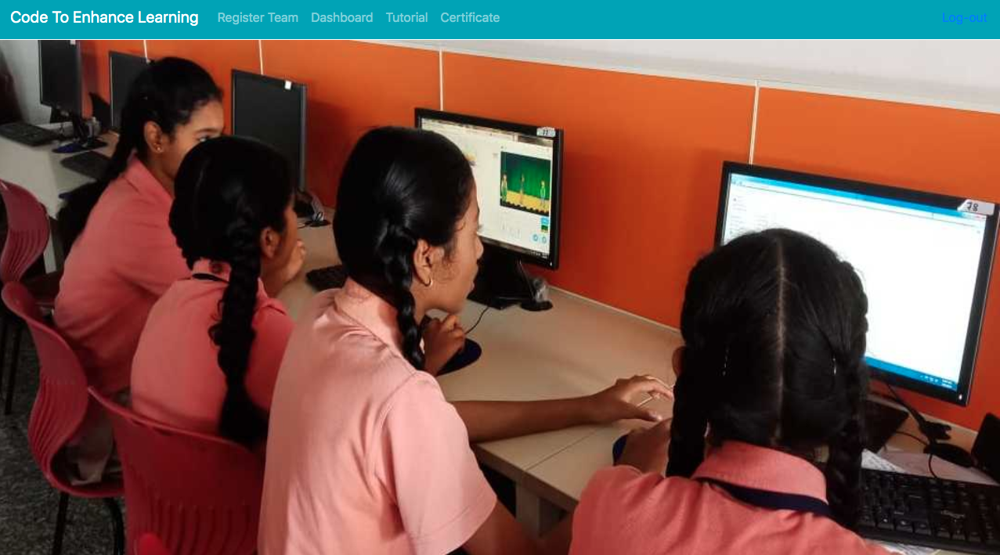
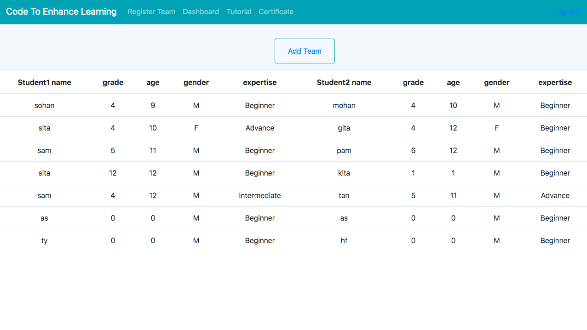
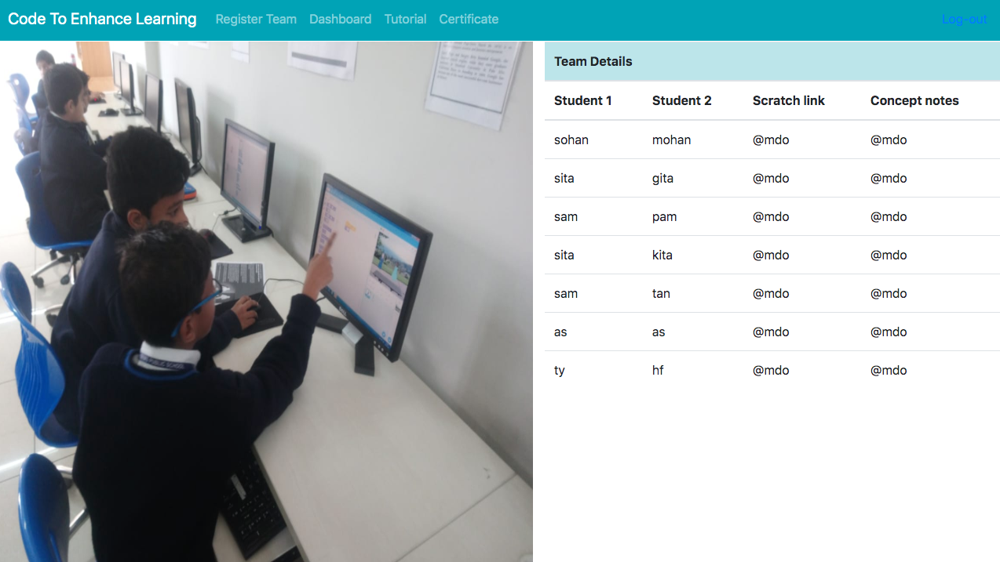

# Code-To-Enhance-Learning

### Prerequisites 
>django 1.11

>python 2.7.10

### Getting Started

>mkdir Product

>cd Product

>virtualenv productfolder

>cd productfolder

>git clone https://github.com/unnatii/Code-To-Enhance-Learning.git

>source bin/activate

>sudo pip install django 

>cd Code-To-Enhance-Learning

>python manage.py migrate

>python manage.py runserver # starts the server 

-**Note: go to browser and open ' localhost:8000/index '**

-**superuser**-
>username- owner
>password- qwertyuiop

### Working

